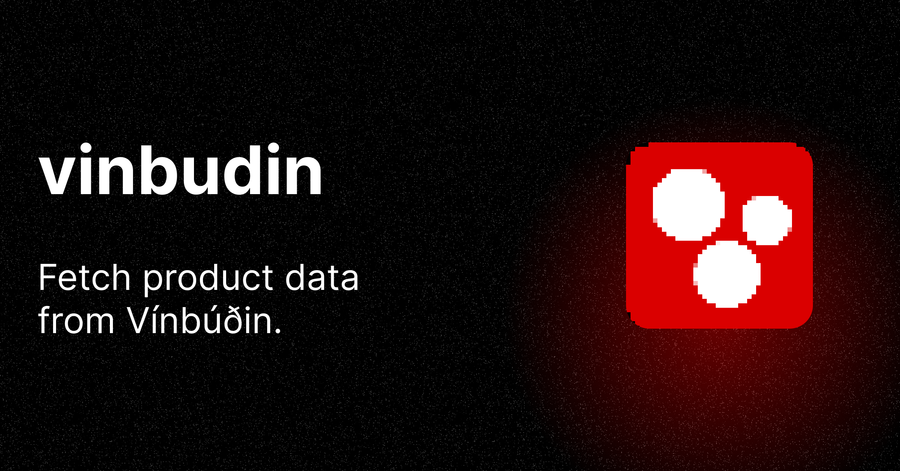

# vinbudin

[![npm version][npm-version-src]][npm-version-href]
[![npm downloads][npm-downloads-src]][npm-downloads-href]
[![License][license-src]][license-href]

> An NPM package to fetch product data from [Vínbúðin](https://www.vinbudin.is/heim).

## Features

- ⚡ Fetch categorized product data from www.vinbudin.is
- 🏷️ Fully typed API

## Setup

```bash
# pnpm
pnpm add -D vinbudin

# npm
npm i -D vinbudin

# yarn
yarn add -D vinbudin
```

## Why?

Vínbúðin does not provide an open API. This package can be used to analyse their product data or create something else from it.

## Basic Usage

```ts
import { getProducts } from 'vinbudin'

getProducts().then((products) => {
  // Handle the data
  console.log(products)
})

// You can also provide an options object to only get specific data
getProducts({
  beer: true,
  bubbly: true,
}).then((products) => {
  // Handle the data
  console.log(products)
})
```

> [!NOTE]
> This package is designed to be used in a server-side environment. Due to restrictions imposed by browsers regarding cross-origin requests (CORS), attempting to use this package in a client-side (browser) environment may result in errors related to CORS policies.

## Methods

### `getProducts(products) -> promise`

Gets products from www.vinbudin.is

- **products** (Object) is an options object that you can optionally pass in if you want some subset of the data.

It looks like this:

```ts
{
  beer: true,
  red: true,
  white: true,
  rose: true,
  bubbly: true,
  fortified: true,
  ciderfruitandblends: true,
  sakeandmead: true,
  strong: true,
  aromatised: true,
}
```

## Working with Client-Side Environments

While this package is primarily intended for use in server-side environments, such as Node.js applications, there are workarounds available for integrating it into client-side environments.

Both Nuxt and Next.js support API routes as an example:

- [Nuxt API routes](https://nuxt.com/docs/guide/directory-structure/server)
- [Next.js API routes](https://nextjs.org/docs/pages/building-your-application/routing/api-routes)

## Example using Nuxt API routes

```ts
// server/api/vinbudin.ts
import { getProducts } from 'vinbudin'

export default defineEventHandler(async () => {
  return await getProducts({ beer: true })
)

// Component
<script setup lang="ts">
const { data } = await useFetch('/api/vinbudin')
</script>
```

<!-- Badges -->

[npm-version-src]: https://img.shields.io/npm/v/vinbudin/latest.svg?style=flat&colorA=18181B&colorB=28CF8D
[npm-version-href]: https://npmjs.com/package/vinbudin
[npm-downloads-src]: https://img.shields.io/npm/dm/vinbudin.svg?style=flat&colorA=18181B&colorB=28CF8D
[npm-downloads-href]: https://npmjs.com/package/vinbudin
[license-src]: https://img.shields.io/npm/l/vinbudin.svg?style=flat&colorA=18181B&colorB=28CF8D
[license-href]: https://npmjs.com/package/vinbudin
